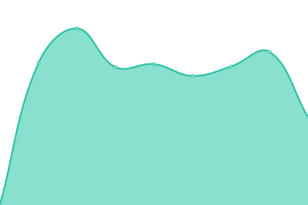

# [📈 Live Status](https://demo.upptime.js.org): <!--live status--> **🟩 All systems operational**

This repository contains the open-source uptime monitor and status page for [Upptime](https://upptime.js.org), powered by [Upptime](https://github.com/upptime/upptime).

With [Upptime](https://upptime.js.org), you can get your own unlimited and free uptime monitor and status page, powered entirely by a GitHub repository. We use [Issues](https://github.com/upptime/upptime/issues) as incident reports, [Actions](https://github.com/zhujunyong/upptime/actions) as uptime monitors, and [Pages](https://demo.upptime.js.org) for the status page.

<!--start: status pages-->
<!-- This summary is generated by Upptime (https://github.com/upptime/upptime) -->
<!-- Do not edit this manually, your changes will be overwritten -->
<!-- prettier-ignore -->
| URL | Status | History | Response Time | Uptime |
| --- | ------ | ------- | ------------- | ------ |
|  [Advocacy Hub](https://www.ibm.com/community/z/advocacy/) | 🟩 Up | [advocacy-hub.yml](https://github.com/andriivasylchenko/upptime/commits/HEAD/history/advocacy-hub.yml) | 

 832ms
     
 | 

<a href="https://andriivasylchenko.github.io/upptime/history/advocacy-hub">99.82%</a>
    

|  [Fans of Z (HL) Group page](https://community.ibm.com/community/user/groupz?CommunityKey=b8b88f20-24c8-49f0-9021-4a8c6247a067) | 🟩 Up | [fans-of-z-hl-group-page.yml](https://github.com/andriivasylchenko/upptime/commits/HEAD/history/fans-of-z-hl-group-page.yml) | 

 465ms
     
 | 

<a href="https://andriivasylchenko.github.io/upptime/history/fans-of-z-hl-group-page">100.00%</a>
    

|  [Z Community (WP) Home page](https://community.ibm.com/zsystems/home/) | 🟩 Up | [z-community-wp-home-page.yml](https://github.com/andriivasylchenko/upptime/commits/HEAD/history/z-community-wp-home-page.yml) | 

 269ms
     
 | 

<a href="https://andriivasylchenko.github.io/upptime/history/z-community-wp-home-page">99.82%</a>
    

|  [IBM Z Advocacy Hub](https://community.ibm.com/zsystems/advocacy/) | 🟩 Up | [ibm-z-advocacy-hub.yml](https://github.com/andriivasylchenko/upptime/commits/HEAD/history/ibm-z-advocacy-hub.yml) | 

 277ms
     
 | 

<a href="https://andriivasylchenko.github.io/upptime/history/ibm-z-advocacy-hub">99.82%</a>
    

|  [Validated Open Source Software](https://community.ibm.com/zsystems/oss/) | 🟩 Up | [validated-open-source-software.yml](https://github.com/andriivasylchenko/upptime/commits/HEAD/history/validated-open-source-software.yml) | 

 279ms
     
 | 

<a href="https://andriivasylchenko.github.io/upptime/history/validated-open-source-software">99.82%</a>
    

|  [API - core - contents/findAll](https://community.ibm.com/zsystems/api/core/contents/findAll) | 🟩 Up | [api-core-contents-find-all.yml](https://github.com/andriivasylchenko/upptime/commits/HEAD/history/api-core-contents-find-all.yml) | 

 282ms
     
 | 

<a href="https://andriivasylchenko.github.io/upptime/history/api-core-contents-find-all">67.28%</a>
    

|  [API - core - events/findAll](https://community.ibm.com/zsystems/api/core/events/findAll) | 🟩 Up | [api-core-events-find-all.yml](https://github.com/andriivasylchenko/upptime/commits/HEAD/history/api-core-events-find-all.yml) | 

 312ms
     
 | 

<a href="https://andriivasylchenko.github.io/upptime/history/api-core-events-find-all">67.28%</a>
    

|  [API - core - blocks/6](https://community.ibm.com/zsystems/api/core/blocks/6) | 🟩 Up | [api-core-blocks-6.yml](https://github.com/andriivasylchenko/upptime/commits/HEAD/history/api-core-blocks-6.yml) | 

 363ms
     
 | 

<a href="https://andriivasylchenko.github.io/upptime/history/api-core-blocks-6">67.28%</a>
    

|  [API - core - forms/1](https://community.ibm.com/zsystems/api/core/forms/1) | 🟩 Up | [api-core-forms-1.yml](https://github.com/andriivasylchenko/upptime/commits/HEAD/history/api-core-forms-1.yml) | 

 303ms
     
 | 

<a href="https://andriivasylchenko.github.io/upptime/history/api-core-forms-1">67.28%</a>
    

|  [API - advocacy - opportunities/findAll](https://community.ibm.com/zsystems/api/advocacy/opportunities/findAll) | 🟩 Up | [api-advocacy-opportunities-find-all.yml](https://github.com/andriivasylchenko/upptime/commits/HEAD/history/api-advocacy-opportunities-find-all.yml) | 

 263ms
     
 | 

<a href="https://andriivasylchenko.github.io/upptime/history/api-advocacy-opportunities-find-all">99.82%</a>
    

|  [API - agenda - events/1](https://community.ibm.com/zsystems/api/agenda/events/1) | 🟩 Up | [api-agenda-events-1.yml](https://github.com/andriivasylchenko/upptime/commits/HEAD/history/api-agenda-events-1.yml) | 

 1205ms
     
 | 

<a href="https://andriivasylchenko.github.io/upptime/history/api-agenda-events-1">69.16%</a>
    

|  [API - oss json](https://community.ibm.com/zsystems/api/oss/json) | 🟩 Up | [api-oss-json.yml](https://github.com/andriivasylchenko/upptime/commits/HEAD/history/api-oss-json.yml) | 

 1656ms
     
 | 

<a href="https://andriivasylchenko.github.io/upptime/history/api-oss-json">69.16%</a>
    

|  [Z Community (WP) Home page 1](https://community.ibm.com/z) | 🟩 Up | [z-community-wp-home-page-1.yml](https://github.com/andriivasylchenko/upptime/commits/HEAD/history/z-community-wp-home-page-1.yml) | 

 432ms
     
 | 

<a href="https://andriivasylchenko.github.io/upptime/history/z-community-wp-home-page-1">99.82%</a>
    

|  [Z Community (WP) Home page 2](https://community.ibm.com/zsystems) | 🟩 Up | [z-community-wp-home-page-2.yml](https://github.com/andriivasylchenko/upptime/commits/HEAD/history/z-community-wp-home-page-2.yml) | 

 332ms
     
 | 

<a href="https://andriivasylchenko.github.io/upptime/history/z-community-wp-home-page-2">99.82%</a>
    

|  [Z Community (WP) Home page 3](https://community.ibm.com/zsystems/) | 🟩 Up | [z-community-wp-home-page-3.yml](https://github.com/andriivasylchenko/upptime/commits/HEAD/history/z-community-wp-home-page-3.yml) | 

 265ms
     
 | 

<a href="https://andriivasylchenko.github.io/upptime/history/z-community-wp-home-page-3">99.82%</a>
    

|  [Z Community (WP) Home page 4](https://community.ibm.com/zsystems/home) | 🟩 Up | [z-community-wp-home-page-4.yml](https://github.com/andriivasylchenko/upptime/commits/HEAD/history/z-community-wp-home-page-4.yml) | 

 343ms
     
 | 

<a href="https://andriivasylchenko.github.io/upptime/history/z-community-wp-home-page-4">99.82%</a>
    

|  [Z Community (WP) Home page 6](https://www.ibm.com/community/z) | 🟩 Up | [z-community-wp-home-page-6.yml](https://github.com/andriivasylchenko/upptime/commits/HEAD/history/z-community-wp-home-page-6.yml) | 

 383ms
     
 | 

<a href="https://andriivasylchenko.github.io/upptime/history/z-community-wp-home-page-6">99.82%</a>
    

|  [Z Community (WP) Home page 7](https://www.ibm.com/community/z/) | 🟩 Up | [z-community-wp-home-page-7.yml](https://github.com/andriivasylchenko/upptime/commits/HEAD/history/z-community-wp-home-page-7.yml) | 

 412ms
     
 | 

<a href="https://andriivasylchenko.github.io/upptime/history/z-community-wp-home-page-7">99.82%</a>
    

|  [Z Community (WP) Home page 8](https://ibm.com/community/z) | 🟩 Up | [z-community-wp-home-page-8.yml](https://github.com/andriivasylchenko/upptime/commits/HEAD/history/z-community-wp-home-page-8.yml) | 

 492ms
     
 | 

<a href="https://andriivasylchenko.github.io/upptime/history/z-community-wp-home-page-8">99.82%</a>
    

|  [Z Community (WP) Home page 9](https://ibm.com/community/z/) | 🟩 Up | [z-community-wp-home-page-9.yml](https://github.com/andriivasylchenko/upptime/commits/HEAD/history/z-community-wp-home-page-9.yml) | 

 406ms
     
 | 

<a href="https://andriivasylchenko.github.io/upptime/history/z-community-wp-home-page-9">99.82%</a>
    

<!--end: status pages-->

[**Visit our status website →**](https://demo.upptime.js.org)

## 📄 License

- Powered by: [Upptime](https://github.com/upptime/upptime)
- Code: [MIT](./LICENSE) © [Upptime](https://upptime.js.org)
- Data in the `./history` directory: [Open Database License](https://opendatacommons.org/licenses/odbl/1-0/)
