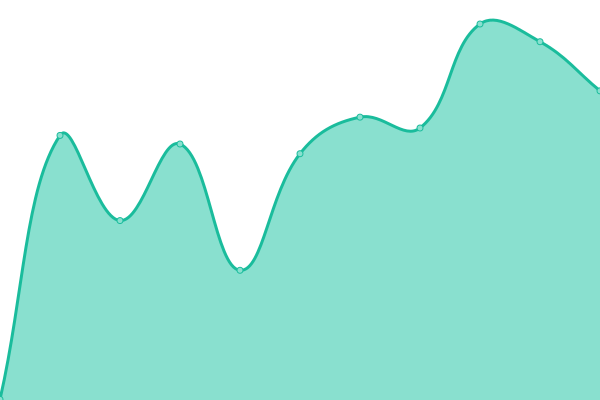

# [📈 Live Status](https://demo.upptime.js.org): <!--live status--> **🟩 All systems operational**

This repository contains the open-source uptime monitor and status page for [Upptime](https://upptime.js.org), powered by [Upptime](https://github.com/upptime/upptime).

With [Upptime](https://upptime.js.org), you can get your own unlimited and free uptime monitor and status page, powered entirely by a GitHub repository. We use [Issues](https://github.com/upptime/upptime/issues) as incident reports, [Actions](https://github.com/zhujunyong/upptime/actions) as uptime monitors, and [Pages](https://demo.upptime.js.org) for the status page.

<!--start: status pages-->
<!-- This summary is generated by Upptime (https://github.com/upptime/upptime) -->
<!-- Do not edit this manually, your changes will be overwritten -->
<!-- prettier-ignore -->
| URL | Status | History | Response Time | Uptime |
| --- | ------ | ------- | ------------- | ------ |
|  [Advocacy Hub](https://www.ibm.com/community/z/advocacy/) | 🟩 Up | [advocacy-hub.yml](https://github.com/andriivasylchenko/upptime/commits/HEAD/history/advocacy-hub.yml) | 

 764ms
     
 | 

<a href="https://andriivasylchenko.github.io/upptime/history/advocacy-hub">99.39%</a>
    

|  [Fans of Z (HL) Group page](https://community.ibm.com/community/user/groupz?CommunityKey=b8b88f20-24c8-49f0-9021-4a8c6247a067) | 🟩 Up | [fans-of-z-hl-group-page.yml](https://github.com/andriivasylchenko/upptime/commits/HEAD/history/fans-of-z-hl-group-page.yml) | 

 412ms
     
 | 

<a href="https://andriivasylchenko.github.io/upptime/history/fans-of-z-hl-group-page">100.00%</a>
    

|  [Neighborhood Home page](https://community.ibm.com/zsystems/neighborhood/home/) | 🟩 Up | [neighborhood-home-page.yml](https://github.com/andriivasylchenko/upptime/commits/HEAD/history/neighborhood-home-page.yml) | 

 284ms
     
 | 

<a href="https://andriivasylchenko.github.io/upptime/history/neighborhood-home-page">99.39%</a>
    

|  [IBM Z Advocacy Hub](https://community.ibm.com/zsystems/advocacy/) | 🟩 Up | [ibm-z-advocacy-hub.yml](https://github.com/andriivasylchenko/upptime/commits/HEAD/history/ibm-z-advocacy-hub.yml) | 

 258ms
     
 | 

<a href="https://andriivasylchenko.github.io/upptime/history/ibm-z-advocacy-hub">99.39%</a>
    

|  [Validated Open Source Software](https://community.ibm.com/zsystems/oss/) | 🟩 Up | [validated-open-source-software.yml](https://github.com/andriivasylchenko/upptime/commits/HEAD/history/validated-open-source-software.yml) | 

 233ms
     
 | 

<a href="https://andriivasylchenko.github.io/upptime/history/validated-open-source-software">99.39%</a>
    

|  [ZISVCAT Home page](https://www.ibm.com/products/z/resources/independent-software-vendor/catalog/) | 🟩 Up | [zisvcat-home-page.yml](https://github.com/andriivasylchenko/upptime/commits/HEAD/history/zisvcat-home-page.yml) | 

 872ms
     
 | 

<a href="https://andriivasylchenko.github.io/upptime/history/zisvcat-home-page">100.00%</a>
    

|  [API - beamz-core - contents/findAll](https://community.ibm.com/zsystems/api/beamz-core/contents/findAll) | 🟩 Up | [api-beamz-core-contents-find-all.yml](https://github.com/andriivasylchenko/upptime/commits/HEAD/history/api-beamz-core-contents-find-all.yml) | 

 254ms
     
 | 

<a href="https://andriivasylchenko.github.io/upptime/history/api-beamz-core-contents-find-all">99.39%</a>
    

|  [API - beamz-agenda - events/findAll](https://community.ibm.com/zsystems/api/beamz-agenda/events/findAll) | 🟩 Up | [api-beamz-agenda-events-find-all.yml](https://github.com/andriivasylchenko/upptime/commits/HEAD/history/api-beamz-agenda-events-find-all.yml) | 

 812ms
     
 | 

<a href="https://andriivasylchenko.github.io/upptime/history/api-beamz-agenda-events-find-all">99.39%</a>
    

|  [API - beamz-advocacy - job-types/findAll](https://community.ibm.com/zsystems/api/beamz-advocacy/job-types/findAll) | 🟩 Up | [api-beamz-advocacy-job-types-find-all.yml](https://github.com/andriivasylchenko/upptime/commits/HEAD/history/api-beamz-advocacy-job-types-find-all.yml) | 

 264ms
     
 | 

<a href="https://andriivasylchenko.github.io/upptime/history/api-beamz-advocacy-job-types-find-all">100.00%</a>
    

|  [API - zisvcat-core - categories/findAll](https://community.ibm.com/zsystems/api/zisvcat-core/categories/findAll) | 🟩 Up | [api-zisvcat-core-categories-find-all.yml](https://github.com/andriivasylchenko/upptime/commits/HEAD/history/api-zisvcat-core-categories-find-all.yml) | 

 273ms
     
 | 

<a href="https://andriivasylchenko.github.io/upptime/history/api-zisvcat-core-categories-find-all">99.39%</a>
    

<!--end: status pages-->

[**Visit our status website →**](https://demo.upptime.js.org)

## 📄 License

- Powered by: [Upptime](https://github.com/upptime/upptime)
- Code: [MIT](./LICENSE) © [Upptime](https://upptime.js.org)
- Data in the `./history` directory: [Open Database License](https://opendatacommons.org/licenses/odbl/1-0/)
